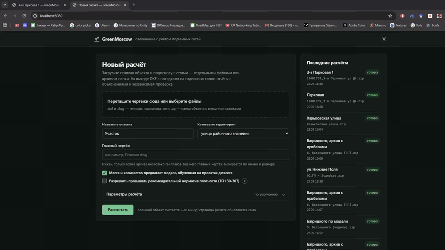
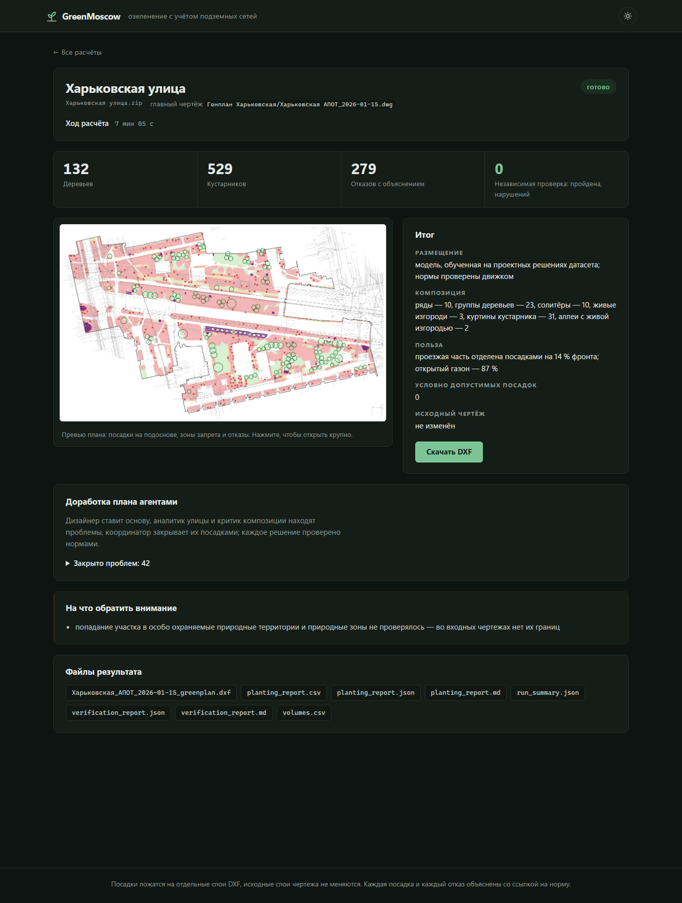
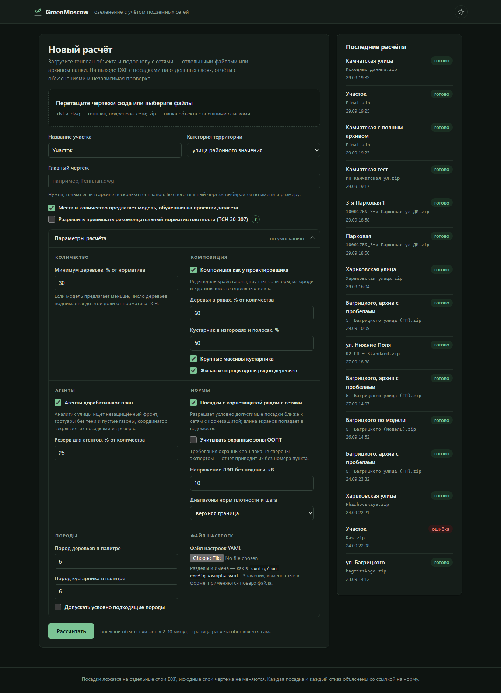
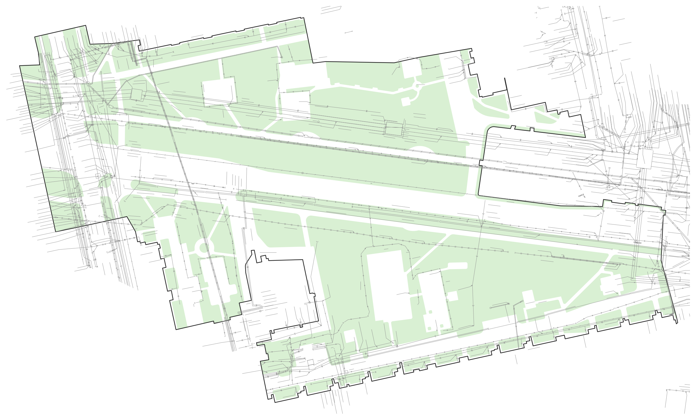
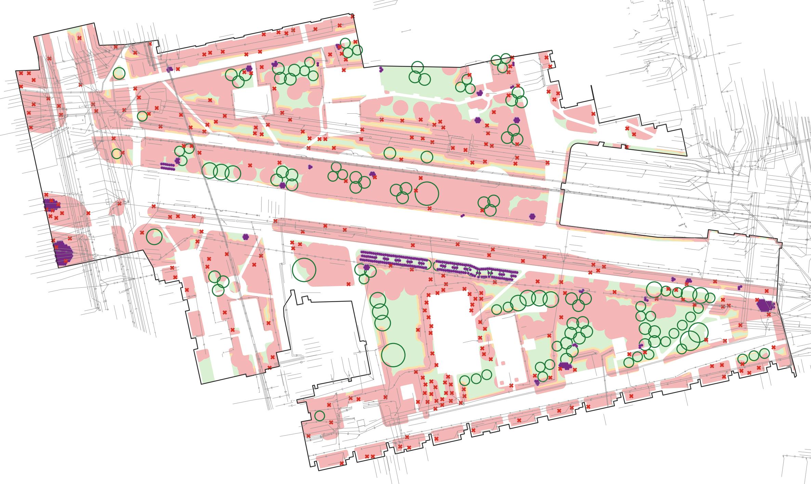
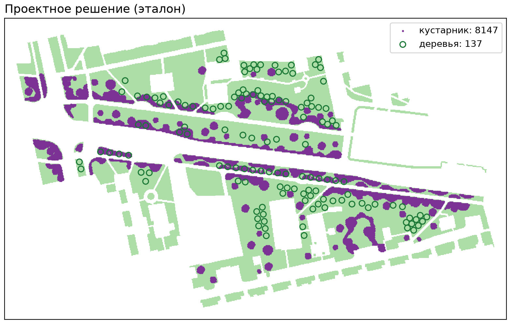
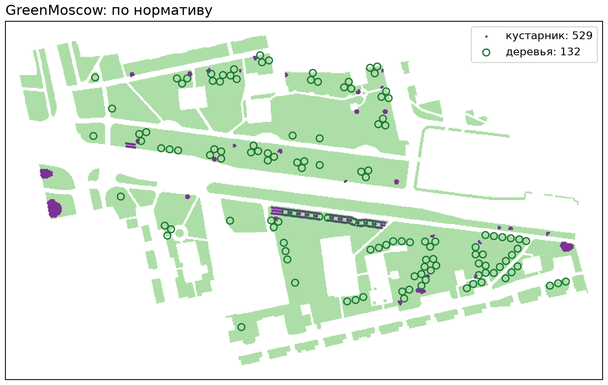
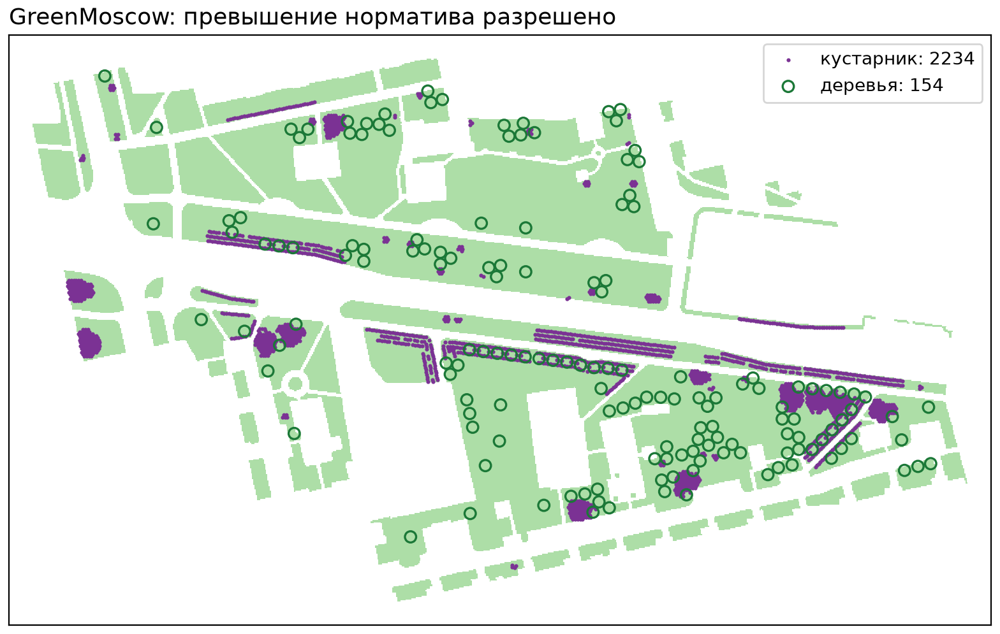
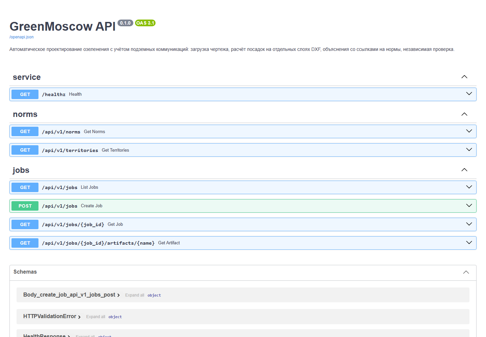

# GreenMoscow — материалы к сдаче

Команда «Команда» · Задача №3 ЛЦТ 2026 (ДПиООС города Москвы): сервис для автоматического
проектирования озеленения города с учётом расположения подземных коммуникаций и городской среды.

В этом репозитории — презентация, видеодемонстрация и скриншоты. Код, Docker, документация и
тесты — в основном репозитории **[GreenMoscow](https://github.com/Ov3rl0rd1/GreenMoscow)**.

| Ресурс | Ссылка |
|---|---|
| Код и документация | [github.com/Ov3rl0rd1/GreenMoscow](https://github.com/Ov3rl0rd1/GreenMoscow) |
| Презентация | [PDF](./GreenMoscow_presentation.pdf) · [PPTX](./GreenMoscow_presentation.pptx) |
| Демонстрация | [output.mp4](./output.mp4) — 4,5 минуты |
| Сайт | публичного стенда нет — серверы дорогие. Веб-интерфейс поднимается локально одной командой, см. ниже |

## Демонстрация



Запись ускорена в 6 раз, полная версия — [output.mp4](./output.mp4). В ней загрузка архива
объекта на сайт, параметры расчёта, ход расчёта и итог на Камчатской улице (199 деревьев,
796 кустарников, 289 отказов с объяснением, нарушений 0), отчёт со ссылками на пункты НПА и
выходной DXF со слоями `AI_*` в просмотрщике.

## Коротко о решении

- **Вход** — чертежи объекта в DXF или DWG: генплан, геоподоснова, внешние ссылки. **Выход** — тот
  же чертёж с дописанными слоями `AI_*` (деревья, кустарники, зоны запрета, корнезащита, отказы) и
  отчёты; исходные слои не меняются.
- **Каждая посадка и каждый отказ объяснены** ссылкой на пункт нормы: СП 42.13330.2016, 743-ПП,
  ТСН 30-307-2002, ПУЭ, перечень инвазивных растений 369-ПП. 57 правил, числа — только в
  справочнике, пункт печатается только у сверенных цитат.
- **Где и сколько сажать** подсказывает модель U-Net, обученная на проектах датасета; композиция
  ставит ряды, группы, живые изгороди и массивы кустарника. Решение «можно или нельзя» принимает
  геометрия норм, результат проходит независимую повторную проверку.
- **Итоговый прогон** 19 объектов датасета: 2 749 деревьев и 17 862 кустарника за 34 минуты на
  ноутбуке, нарушений после проверки 0, исходные чертежи целы на всех объектах.

## Как запустить сайт локально

```bash
git clone https://github.com/Ov3rl0rd1/GreenMoscow
cd GreenMoscow
docker compose up --build
```

- веб-интерфейс — <http://localhost:8080>
- API и Swagger — <http://localhost:8000/docs>

Расчёт идёт офлайн. Для объекта из датасета загрузите архив папки «Исходные данные» — главный
чертёж и внешние ссылки с сетями определяются автоматически.

## Скриншоты

### Страница расчёта: Харьковская улица



### Параметры расчёта прямо на сайте



### До и после: Харьковская улица

| Что сервис распознал в чертеже | Что предложил |
|---|---|
|  |  |

Газон, граница работ и подземные сети из подосновы; справа — 132 дерева, 529 кустарников,
279 отказов с причиной, розовое — зоны запрета, нарушений 0.

### Сравнение с проектом подрядчика

| Проектное решение (эталон) | GreenMoscow: по нормативу | GreenMoscow: превышение норматива разрешено |
|---|---|---|
|  |  |  |

### API со Swagger


